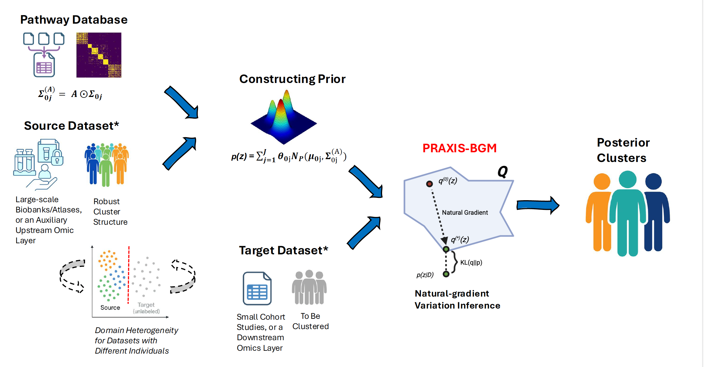

# Praxis-BGM
High-dimensional omic data are typically measured on limited sample sizes, which challenges model-based
clustering methods such as Gaussian mixture models, often leading to instability and poor generalization under complex
mixture structures. To address these limitations, we developed Praxis-BGM, a natural-gradient variational inference
framework for Gaussian mixture models that incorporates informative priors—cluster-specific means, covariances, and
structural connectivity—from large-scale reference data with robust cluster structures to enable semi-supervised transfer
learning on a small target dataset. 

## Updated installable layout for the latest Praxis algorithm

This folder packages the newest `Praxis` algorithm in the installable
`Praxis-BGM` repository structure. The core implementation now lives under
`src/praxis_bgm/`, while tutorials and runnable examples stay at the repository
root.

The main user-facing class is:

```python
from praxis_bgm import Praxis_BGM
```

## What's included

- `src/praxis_bgm/core.py`: high-level `Praxis_BGM` model API
- `src/praxis_bgm/utility.py`: numerical helpers and damped NGVI updates
- `src/praxis_bgm/prior_utils.py`: source-to-target alignment and prior builders
- `Praxis_tutorial.py`: end-to-end transfer-learning tutorial script
- `Praxis_BGM_Tutorial.ipynb`: notebook walkthrough

## Installation

To keep the package, tutorials, and application examples in one place, use a
dedicated Conda environment named `Praxis_env`.

### Recommended environment

Create and activate the environment:

```bash
conda create -n Praxis_env python=3.10 -y
conda activate Praxis_env
```

Core libraries required for the packaged `praxis_bgm` library and the main
Python tutorial:

- `jax`
- `jaxlib`
- `numpy`
- `pandas`
- `scikit-learn`
- `matplotlib`

Additional libraries required for the scripted `METABRIC_TCGABRCA` example:

- `scipy`
- `statsmodels`
- `lifelines`

Additional libraries required for the notebook-based
`Pancreas_scRNA_label_transfer` example:

- `anndata`
- `scanpy`
- `scvi-tools`
- `scrublet`
- `bbknn`
- `scanorama`
- `jupyterlab`
- `ipykernel`

Optional R-side libraries for `Praxis_R_Wrapper.Rmd`:

- `reticulate`
- `rmarkdown`
- `knitr`

One practical way to provision `Praxis_env` is:

```bash
conda create -n Praxis_env python=3.10 -y
conda activate Praxis_env
pip install -e .
pip install scipy statsmodels lifelines anndata scanpy scvi-tools scrublet bbknn scanorama jupyterlab ipykernel
```

If you also want to render the R wrapper from the same Conda environment, add:

```bash
conda install -n Praxis_env -c conda-forge r-base r-reticulate r-rmarkdown r-knitr -y
```

From the repository root:

```bash
pip install -e .
```

Or install directly from a local checkout:

```bash
pip install git+https://github.com/ContiLab-usc/Praxis-BGM.git
```

## Repository layout

```text
Praxis/
├── LICENSE
├── README.md
├── Praxis_BGM_Tutorial.ipynb
├── Praxis_tutorial.py
├── praxis_in_serial.py
├── pyproject.toml
└── src/
    └── praxis_bgm/
        ├── __init__.py
        ├── core.py
        ├── prior_utils.py
        └── utility.py
```

## Quick start

```python
import jax
import numpy as np
from praxis_bgm import Praxis_BGM

X = np.array(
    [
        [-2.2, -1.8],
        [-1.8, -2.3],
        [1.7, 2.5],
        [2.3, 1.8],
    ],
    dtype=np.float32,
)

prior_mus = np.array(
    [
        [-2.0, -2.0],
        [2.0, 2.0],
    ],
    dtype=np.float32,
)

model = Praxis_BGM(
    rng_key=jax.random.PRNGKey(0),
    K=2,
    prior_mus=prior_mus,
    beta=1e-3,
    num_samples=8,
    elbo_eval_freq=1,
    verbose=True,
)

model.fit(X, num_iters=200, batch_size=4)

assignments, weights = model.predict(X)
posterior_mus, posterior_covs, posterior_pis, responsibilities = model.get_posteriors(X)

print("Assignments:", assignments)
print("Weights:", weights)
print("Posterior means:\n", posterior_mus)
print("Posterior covariances:\n", posterior_covs)
print("Posterior mixture weights:", posterior_pis)
print("Responsibilities:\n", responsibilities)
```

## Main model arguments

- `K`: number of mixture components
- `prior_mus`, `prior_Sigmas`, `prior_weights`: optional transferred priors
- `init_mus`, `init_covs`, `init_pis`: optional variational initialization
- `beta`: step size for mean and weight updates
- `rho_prec`: damping for covariance / precision updates
- `rho_mu`: damping for mean updates
- `num_samples`: number of anchor samples used per NGVI update
- `data_precision_int`: optional scalar observation precision override
- `likelihood_temp`: scaling on the minibatch likelihood term
- `sparse_A` / `cluster_A`: optional structural masks
- `freeze_A_zeros`: keep zero-masked covariance entries fixed during training

## Tutorials

- Script walkthrough: [Praxis_tutorial.py](./Praxis_tutorial.py)
- Notebook walkthrough: [Praxis_BGM_Tutorial.ipynb](./Praxis_BGM_Tutorial.ipynb)
- Application example: [applications/METABRIC_TCGABRCA/README.md](./applications/METABRIC_TCGABRCA/README.md)
- Application example: [applications/Pancreas_scRNA_label_transfer/README.md](./applications/Pancreas_scRNA_label_transfer/README.md)

## Application examples

The repository includes multiple real-data application workflows under
`applications/`. These are the best entry points when you want a practical
analysis example rather than a minimal synthetic tutorial.

### METABRIC_TCGABRCA

This is a self-contained transfer-learning workflow for the METABRIC-to-TCGA
breast cancer subtype analysis.

Use it when you want to:

- run the installed `praxis_bgm` package on a real omics dataset
- reproduce the legacy subtype transfer workflow with the current software
- benchmark `Praxis` against `BGM` on the same target cohort
- generate subtype association metrics, cluster assignments, and 5-year Cox survival outputs

The application folder already contains the required `1000gene` input files in
`applications/METABRIC_TCGABRCA/data/`, so the default run is self-contained.

Typical usage:

```bash
conda activate Praxis_env
python applications/METABRIC_TCGABRCA/run_metabric_tcga_subtype_sup.py --gene-suffix 1000gene
```

Main outputs are written to `applications/METABRIC_TCGABRCA/output/1000gene/`.

### Pancreas_scRNA_label_transfer

This application contains a notebook-based single-cell label transfer workflow
for the human pancreas benchmark dataset.

Use it when you want to:

- study a label-transfer use case in single-cell RNA-seq data
- compare Praxis-BGM against ingest, BBKNN, Scanorama, ComBat, scVI, and scANVI-style workflows
- inspect notebook-driven figures such as UMAPs, confusion heatmaps, and classification reports

The application folder includes:

- `Praxis_BGM_label_transfer_snRNA_seq_pancreas.ipynb`
- `human_pancreas_norm_complexBatch.h5ad`

The pancreas example is notebook-first and still contains some Colab and
Google Drive output paths, so it is best treated as an analysis template that
you can adapt to your own local output directory. The new application README
for that folder explains the workflow structure and the main outputs to look
for.

For step-by-step usage details, inputs, outputs, and interpretation guidance,
see the application READMEs linked above.

## Notes

- The package requires Python 3.9+.
- JAX is used for the core optimization and Monte Carlo ELBO evaluation.
- This layout is intended to replace the older `Praxis-BGM` repo structure while
  preserving the newer damped global-z-prior implementation from `Praxis/`.
